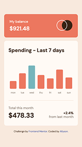
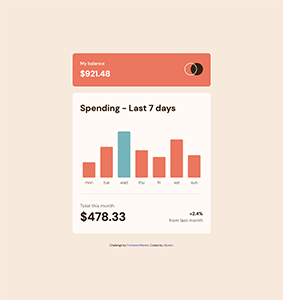

# Frontend Mentor - Expenses chart component solution

This is a solution to the [Expenses chart component challenge on Frontend Mentor](https://www.frontendmentor.io/challenges/expenses-chart-component-e7yJBUdjwt). Frontend Mentor challenges help you improve your coding skills by building realistic projects.

## Table of contents

- [Overview](#overview)
  - [The challenge](#the-challenge)
  - [Screenshot](#screenshot)
  - [Links](#links)
- [My process](#my-process)
  - [Built with](#built-with)
  - [What I learned](#what-i-learned)
  - [Continued development](#continued-development)
  - [Useful resources](#useful-resources)
- [Author](#author)

## Overview

### The challenge

Users should be able to:

- View the bar chart and hover over the individual bars to see the correct amounts for each day
- See the current day’s bar highlighted in a different colour to the other bars
- View the optimal layout for the content depending on their device’s screen size
- See hover states for all interactive elements on the page
- **Bonus**: Use the JSON data file provided to dynamically size the bars on the chart

### Screenshot

### Links

- Solution URL: [https://github.com/allyson-s-code/expense-chart-component](https://github.com/allyson-s-code/expense-chart-component)
- Live Site URL: [https://allyson-s-code.github.io/expense-chart-component/](https://allyson-s-code.github.io/expense-chart-component/)

## My process

### Built with

- Semantic HTML5 markup
- CSS custom properties
- Flexbox
- Mobile-first workflow
- Chart.js

### What I learned

This was my first time using chart.js and it was a lot of fun. Chart.js has lots of documentation and videos and I found the videos very helpful.

### Continued development

I will continue working with data dynamically and my JavaScript skills.

### Useful resources

- [Chart.js](https://www.chartjs.org/) - So so helpful. Lots of documentation.
- [How to make font sizes responsive Chart.js YouTube](https://www.youtube.com/watch?v=V3J8r3717BY)

## Author

- Website - [Allyson Smith](https://allyson-s-code.github.io/Web-Dev-Portfolio/)
- Frontend Mentor - [@allyson-s-code](https://www.frontendmentor.io/profile/allyson-s-code)
